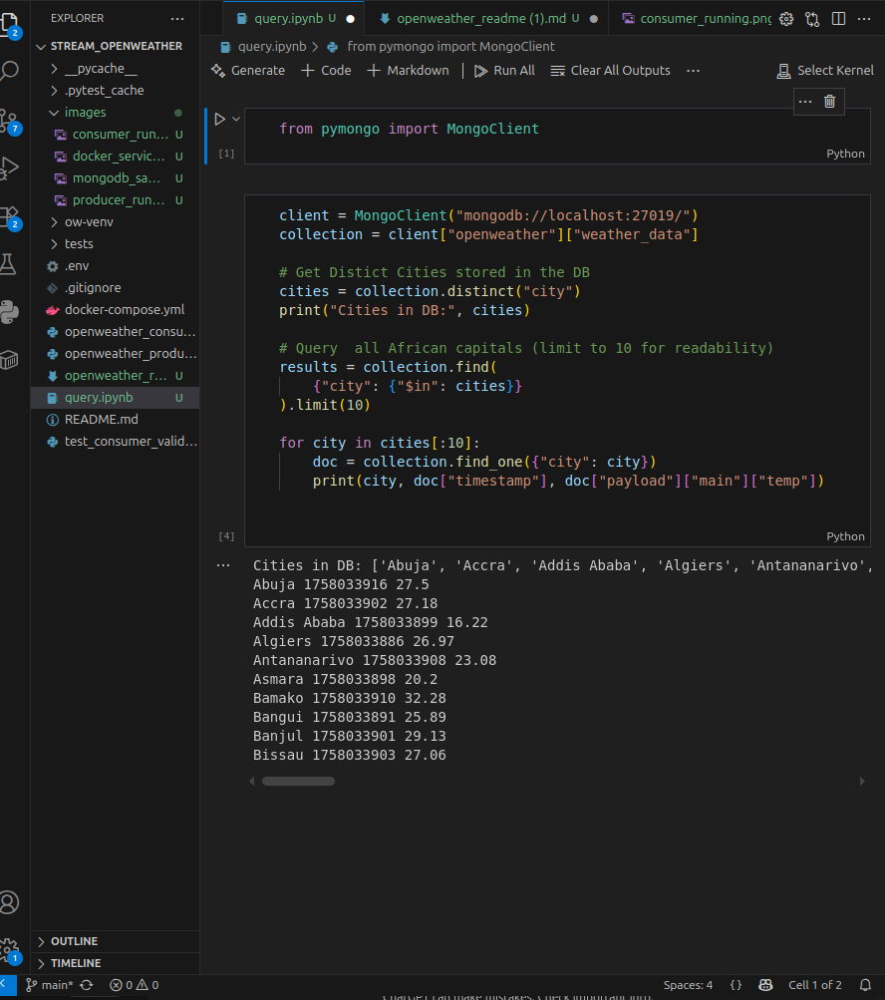

# OpenWeather Streaming Pipeline with Kafka & MongoDB

A real-time data streaming pipeline that fetches weather data for **all African capital cities** from the OpenWeather API, streams it via **Apache Kafka**, validates with **Pydantic**, and stores in **MongoDB**.


*Pipeline flow: OpenWeather API → Kafka Producer → Kafka Topic → Consumer → MongoDB*

## Features

- **Real-time Data Streaming**: Continuous weather data collection for 54 African capitals
- **Data Validation**: Robust schema validation using Pydantic models
- **Fault Tolerance**: Kafka ensures reliable message delivery and processing
- **MongoDB Storage**: Structured data storage with built-in schema validation
- **Comprehensive Testing**: Unit tests for data models and validation logic
- **Docker Compose Setup**: One-command infrastructure deployment
- **Extensible Architecture**: Easy to add analytics, dashboards, or additional consumers

## Tech Stack

| Component | Technology |
|-----------|------------|
| **Language** | Python 3.8+ |
| **Message Broker** | Apache Kafka + Zookeeper |
| **Database** | MongoDB |
| **Data Validation** | Pydantic |
| **HTTP Client** | Requests |
| **Containerization** | Docker Compose |
| **Testing** | Pytest |

## Quick Start

### Prerequisites

- Docker & Docker Compose
- Python 3.8+
- OpenWeather API key (free at [openweathermap.org](https://openweathermap.org/api))

### 1. Clone Repository

```bash
git clone https://github.com/<your-username>/stream_openweather.git
cd stream_openweather
```

### 2. Environment Configuration

Create a `.env` file in the project root:

```env
# OpenWeather API Configuration
OPENWEATHER_API_KEY=your_api_key_here

# Kafka Configuration
KAFKA_BOOTSTRAP_SERVERS=localhost:9092
KAFKA_TOPIC=openweather.raw

# MongoDB Configuration
MONGO_URI=mongodb://localhost:27019/
MONGO_DB=openweather
MONGO_COLLECTION=weather_data
```

**Important**: Never commit the `.env` file to version control!

### 3. Start Infrastructure

```bash
docker-compose up -d
```


*Docker containers running Kafka, Zookeeper, and MongoDB*

### 4. Install Python Dependencies

```bash
pip install -r requirements.txt
```

### 5. Run the Pipeline

**Start the Producer** (in one terminal):
```bash
python openweather_producer.py
```


*Producer fetching and sending weather data to Kafka*

**Start the Consumer** (in another terminal):
```bash
python openweather_consumer.py
```


*Consumer processing messages and storing validated data*

## Data Schema

### Weather Record Structure

```python
class WeatherRecord(BaseModel):
    city: str
    country: str
    timestamp: datetime
    payload: dict
    
    class Config:
        json_encoders = {
            datetime: lambda v: v.isoformat()
        }
```

### Sample MongoDB Document

```json
{
  "_id": "ObjectId(...)",
  "city": "Nairobi",
  "timestamp": "2024-01-15T10:30:00Z",
  "payload": {
    "coord": {"lon": 36.8167, "lat": -1.2833},
    "weather": [{"main": "Clear", "description": "clear sky"}],
    "main": {
      "temp": 298.15,
      "feels_like": 298.65,
      "temp_min": 297.15,
      "temp_max": 299.15,
      "pressure": 1013,
      "humidity": 65
    },
    "wind": {"speed": 3.5, "deg": 180},
    "clouds": {"all": 10}
  }
}
```


## Data Analysis & Insights(Optional/Future)

### Jupyter Notebook Analysis

The project includes a comprehensive Jupyter notebook (`query.ipynb`) that demonstrates advanced data analysis capabilities:

**Key Analysis Features:**
- **Temperature Trends**: Historical temperature analysis across African capitals
- **Geographic Insights**: Weather pattern correlations by region
- **Statistical Analysis**: Mean, median, and variance calculations
- **Data Visualization**: Interactive plots and charts
- **City Comparisons**: Side-by-side weather comparisons
- **Time Series Analysis**: Weather trends over time

### Running the Analysis

```bash
# Install Jupyter dependencies
pip install jupyter matplotlib seaborn plotly pandas

# Start Jupyter Lab
jupyter lab query.ipynb
```

The notebook provides ready-to-run cells for:
- Connecting to your MongoDB instance
- Performing complex aggregation queries
- Creating visualizations with matplotlib/seaborn
- Generating insights and statistical reports

## Querying Data

### Verify Data Collection

First, check that your pipeline is working and collecting data:

```python
from pymongo import MongoClient
import os
from dotenv import load_dotenv

load_dotenv()

client = MongoClient(os.getenv('MONGO_URI'))
collection = client[os.getenv('MONGO_DB')][os.getenv('MONGO_COLLECTION')]

# Check cities in database
cities_in_db = collection.distinct("city")
print(f"Cities in DB: {cities_in_db}")
print(f"Total cities: {len(cities_in_db)}")
```

### Get Latest Temperature for All Cities

```python
# Get latest weather data with timestamps
for city in collection.distinct("city"):
    latest = collection.find({"city": city}).sort("timestamp", -1).limit(1)[0]
    temp_celsius = latest["payload"]["main"]["temp"] - 273.15
    timestamp = latest["timestamp"]
    print(f"{city} {timestamp} {temp_celsius:.2f}")
```

**Sample Output:**


*Live data showing 10 of 52 African capitals with real-time temperature data*

### Simple Analytics Queries

```python
# Count total records
total_records = collection.count_documents({})
print(f"Total weather records: {total_records}")

# Find hottest cities currently
pipeline = [
    {"$sort": {"timestamp": -1}},
    {"$group": {
        "_id": "$city",
        "latest_temp": {"$first": "$payload.main.temp"},
        "country": {"$first": "$country"}
    }},
    {"$sort": {"latest_temp": -1}},
    {"$limit": 5}
]

hottest = list(collection.aggregate(pipeline))
print("\n Top 5 Hottest Cities:")
for city in hottest:
    temp_c = city["latest_temp"] - 273.15
    print(f"{city['_id']}, {city['country']}: {temp_c:.1f}°C")
```

## Testing

Run the test suite:

```bash
pytest -v
```

```bash
pytest tests/test_models.py -v  # Test data models
pytest tests/test_producer.py -v  # Test producer logic
pytest tests/test_consumer.py -v  # Test consumer validation
```


*Comprehensive test coverage for data validation and pipeline components*

## 📁 Project Structure

```
stream_openweather/
├── docker-compose.yml          # Infrastructure setup
├── .env.example               # Environment template
├── .gitignore                 # Git ignore rules
├── README.md                  # This file
├── openweather_producer.py    # Kafka producer
├── openweather_consumer.py    # Kafka consumer
├── tests/
│   ├── test_models.py         # Model validation tests
│   ├── test_producer.py       # Producer tests
│   └── test_consumer.py       # Consumer tests
└── images/                # Screenshots and diagrams
```

## Docker Services

| Service | Port | Purpose |
|---------|------|---------|
| **Zookeeper** | 2181 | Kafka coordination |
| **Kafka** | 9092 | Message streaming |
| **MongoDB** | 27019 | Data storage |

### Service Health Checks

```bash
# Check Kafka topics
docker exec -it kafka kafka-topics.sh --bootstrap-server localhost:9092 --list

# Check MongoDB connection
docker exec -it mongodb mongo --eval "db.adminCommand('ismaster')"
```

## Production Considerations

### Scaling

- **Multiple Consumers**: Add consumer groups for parallel processing
- **Partitioned Topics**: Scale Kafka topic partitions for higher throughput
- **MongoDB Sharding**: Distribute data across multiple MongoDB instances

### Monitoring

- **Kafka Manager**: Monitor topic health and consumer lag
- **MongoDB Compass**: Visual database management
- **Application Metrics**: Add logging and monitoring with Prometheus/Grafana

### Security

- **API Rate Limits**: Implement backoff strategies for OpenWeather API
- **Kafka Security**: Configure SASL/SSL for production Kafka clusters
- **MongoDB Auth**: Enable authentication and authorization

## Future Enhancements

- [ ] **Real-time Dashboard**: Streamlit/Grafana visualization
- [ ] **Data Analytics**: Historical trend analysis
- [ ] **Alert System**: Weather threshold notifications  
- [ ] **Cloud Deployment**: AWS MSK + MongoDB Atlas
- [ ] **CI/CD Pipeline**: Automated testing and deployment
- [ ] **Data Export**: CSV/JSON export functionality

## Contributing

1. Fork the repository
2. Create a feature branch (`git checkout -b feature/amazing-feature`)
3. Commit changes (`git commit -m 'Add amazing feature'`)
4. Push to branch (`git push origin feature/amazing-feature`)
5. Open a Pull Request


## 🔗 Resources

- [OpenWeather API Documentation](https://openweathermap.org/api)
- [Apache Kafka Documentation](https://kafka.apache.org/documentation/)
- [MongoDB Documentation](https://docs.mongodb.com/)
- [Pydantic Documentation](https://pydantic-docs.helpmanual.io/)

